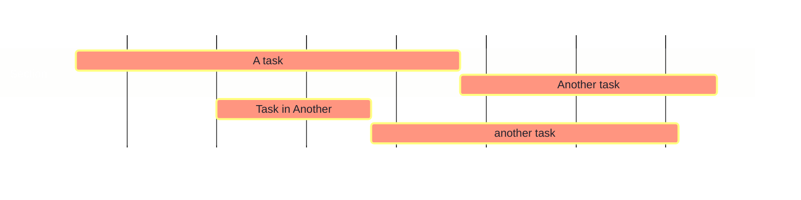

# Test Page


# Header 1

Lorem ipsum

## Header 2

Lorem ipsum

### Header 3

Lorem ipsum

#### Header 4

Lorem ipsum

##### Header 5

Lorem ipsum

###### Header 6

Content Tabs

=== "Display"

    Texte normal, ==en évidence==, **gras**, ~~barré~~, ou _italique_.
    **Bold text and _nested italic_ text**.
    __Bold text and *nested italic, ==who== wins?*__

=== "Markdown"

    ```
      Texte normal, ==en évidence==, **gras**, ~~barré~~, ou _italique_.
      **Bold text and _nested italic_ text**.
      __Bold text and *nested italic, ==who== wins?*__
    ```


# Code

Et `litéral` dans le texte…

```python
def factorial(n: int) -> int:
    """Compute factorial (!) of an integer number

       Raises:
           ValueError: argument is not non negative integer
    """
    if not isinstance(n, int) or n < 0:
        print("not non negative integer")
        raise ValueError
    return 1 if n == 0 else n * factorial(n - 1)
```


# Callouts

## Obsidian Style

> [!info] Callout

> [!warning] Warning: Lorem Ipsum


## Py-Mdown Style

> [!warning] This is not properly displayed in Obsidian…

/// admonition | A Title
    type: info
Please read the [airport](airport.md) for information on extension compatibility and general notes to be
aware of when using these extensions.
///

/// warning | Reminder
Shortcut to define the admonition type.
///


## Mkdocs Material Style

> [!warning] This is not properly displayed in Obsidian…

!!! danger "Warning message goes here"
    Please read the [airport](airport.md) for information on extension compatibility and general notes to be
    aware of when using these extensions.


# Definition Lists

Les listes de définitions sont pratiques pour énumérer les options en les décrivant:

`élément`
:   La définition suit
    Pour les descriptions, etc.
    Curieux de voir le résultat.

autre définition
:   Autre description. le terme n'est pas nécessairement mis en évidence.

*autre définition*
:   Autre description. le terme peut être mis en évidence de plusieurs façons.


# Diagrams

## Mermaid

Sample Gantt diagram



## Vega and Vega Lite

### Simpler Chart (Vega Lite)

```vega-lite
{
    "$schema": "https://vega.github.io/schema/vega-lite/v5.json",
    "description": "A simple bar chart with embedded data.",
    "background": "#44475A",
    "data": {
      "values": [
        {"a": "A", "b": 28}, {"a": "B", "b": 55}, {"a": "C", "b": 43},
        {"a": "D", "b": 91}, {"a": "E", "b": 81}, {"a": "F", "b": 53},
        {"a": "G", "b": 19}, {"a": "H", "b": 87}, {"a": "I", "b": 52}
      ]
    },
    "mark":
    {
        "type": "bar",
        "cornerRadiusEnd": 4
    },
    "encoding":
    {
        "x":
        {
            "field": "a",
            "type": "nominal",
            "axis":
            {
                "labelAngle": 0,
                "labelColor": "#FF79C6",
                "titleColor": "#FF79C6"
            }
        },
        "y":
        {
            "field": "b",
            "type": "quantitative",
            "axis":
            {
                "titleAngle": 0,
                "labelColor": "#FFB86C",
                "titleColor": "#FFB86C"
            }
        },
        "color":
        {
            "value": "#BD93F9"
        }
    }
}
```

### Climate Stripes (Vega)

```vega
{
  "$schema": "https://vega.github.io/schema/vega/v5.json",
  "description": "Warming Stripes Chart. Originally designed by Ed Hawkins.",
  "usermeta": {
    "Author": "Andrzej Leszkiewicz",
    "Github": "https://github.com/avatorl/Deneb-Vega/",
    "License": "CC BY 4.0 (Share and Adapt with Attribution)",
    "Original Idea Author": "Ed Hawkins",
    "Original Idea URL": "https://www.climate-lab-book.ac.uk/2018/warming-stripes/",
    "Read More URL": "https://en.wikipedia.org/wiki/Warming_stripes",
    "Data Source URL": "https://climate.nasa.gov/vital-signs/global-temperature/"
  },
  "background": "white",
  "width": 650,
  "height": 200,
  "padding": 10,
  "autosize": "pad",
  "config": {},
  "signals": [
    {"name": "fontMain", "value": "Tahoma"},
    {"name": "labelColor", "value": "#808080"},
    {"name": "labelDataSrcColor", "value": "#CCCCCC"},
    {"name": "basePeriodColor", "value": "black"},
    {"name": "titleFontSize", "value": "16"},
    {"name": "labelFontSizeMajor", "value": "20"},
    {"name": "labelFontSizeMinor", "value": "14"},
    {"name": "legendFontSize", "value": "12"},
    {"name": "labelDataSrcFontSize", "value": "12"},
    {"name": "basePeriodS", "value": "1951"},
    {"name": "basePeriodE", "value": "1980"},
    {
      "name": "selectedStripeTemp",
      "description": "Temperature in the selected year (stripe). To dispaly as a tick on the legend.",
      "value": "0",
      "on": [
        {"events": "@stripe:pointerover", "update": "datum.temp"},
        {"events": "@stripe:pointerout", "update": "0"}
      ]
    }
  ],
  "data": [
    {
      "name": "dataset",
      "values": [
        {"year":1880,"temp":-0.17},
        {"year":1881,"temp":-0.09},
        {"year":1882,"temp":-0.11},
        {"year":1883,"temp":-0.17},
        {"year":1884,"temp":-0.28},
        {"year":1885,"temp":-0.33},
        {"year":1886,"temp":-0.31},
        {"year":1887,"temp":-0.36},
        {"year":1888,"temp":-0.17},
        {"year":1889,"temp":-0.1},
        {"year":1890,"temp":-0.35},
        {"year":1891,"temp":-0.22},
        {"year":1892,"temp":-0.27},
        {"year":1893,"temp":-0.31},
        {"year":1894,"temp":-0.31},
        {"year":1895,"temp":-0.23},
        {"year":1896,"temp":-0.11},
        {"year":1897,"temp":-0.11},
        {"year":1898,"temp":-0.27},
        {"year":1899,"temp":-0.17},
        {"year":1900,"temp":-0.08},
        {"year":1901,"temp":-0.15},
        {"year":1902,"temp":-0.28},
        {"year":1903,"temp":-0.37},
        {"year":1904,"temp":-0.47},
        {"year":1905,"temp":-0.26},
        {"year":1906,"temp":-0.22},
        {"year":1907,"temp":-0.39},
        {"year":1908,"temp":-0.43},
        {"year":1909,"temp":-0.48},
        {"year":1910,"temp":-0.44},
        {"year":1911,"temp":-0.44},
        {"year":1912,"temp":-0.37},
        {"year":1913,"temp":-0.34},
        {"year":1914,"temp":-0.15},
        {"year":1915,"temp":-0.14},
        {"year":1916,"temp":-0.36},
        {"year":1917,"temp":-0.46},
        {"year":1918,"temp":-0.29},
        {"year":1919,"temp":-0.27},
        {"year":1920,"temp":-0.27},
        {"year":1921,"temp":-0.19},
        {"year":1922,"temp":-0.28},
        {"year":1923,"temp":-0.26},
        {"year":1924,"temp":-0.27},
        {"year":1925,"temp":-0.22},
        {"year":1926,"temp":-0.11},
        {"year":1927,"temp":-0.22},
        {"year":1928,"temp":-0.2},
        {"year":1929,"temp":-0.36},
        {"year":1930,"temp":-0.16},
        {"year":1931,"temp":-0.09},
        {"year":1932,"temp":-0.16},
        {"year":1933,"temp":-0.29},
        {"year":1934,"temp":-0.12},
        {"year":1935,"temp":-0.2},
        {"year":1936,"temp":-0.15},
        {"year":1937,"temp":-0.03},
        {"year":1938,"temp":0},
        {"year":1939,"temp":-0.02},
        {"year":1940,"temp":0.12},
        {"year":1941,"temp":0.18},
        {"year":1942,"temp":0.06},
        {"year":1943,"temp":0.09},
        {"year":1944,"temp":0.2},
        {"year":1945,"temp":0.09},
        {"year":1946,"temp":-0.07},
        {"year":1947,"temp":-0.03},
        {"year":1948,"temp":-0.11},
        {"year":1949,"temp":-0.11},
        {"year":1950,"temp":-0.17},
        {"year":1951,"temp":-0.07},
        {"year":1952,"temp":0.01},
        {"year":1953,"temp":0.08},
        {"year":1954,"temp":-0.13},
        {"year":1955,"temp":-0.14},
        {"year":1956,"temp":-0.19},
        {"year":1957,"temp":0.05},
        {"year":1958,"temp":0.06},
        {"year":1959,"temp":0.03},
        {"year":1960,"temp":-0.03},
        {"year":1961,"temp":0.06},
        {"year":1962,"temp":0.03},
        {"year":1963,"temp":0.05},
        {"year":1964,"temp":-0.2},
        {"year":1965,"temp":-0.11},
        {"year":1966,"temp":-0.06},
        {"year":1967,"temp":-0.02},
        {"year":1968,"temp":-0.08},
        {"year":1969,"temp":0.05},
        {"year":1970,"temp":0.03},
        {"year":1971,"temp":-0.08},
        {"year":1972,"temp":0.01},
        {"year":1973,"temp":0.16},
        {"year":1974,"temp":-0.07},
        {"year":1975,"temp":-0.01},
        {"year":1976,"temp":-0.1},
        {"year":1977,"temp":0.18},
        {"year":1978,"temp":0.07},
        {"year":1979,"temp":0.16},
        {"year":1980,"temp":0.26},
        {"year":1981,"temp":0.32},
        {"year":1982,"temp":0.14},
        {"year":1983,"temp":0.31},
        {"year":1984,"temp":0.16},
        {"year":1985,"temp":0.12},
        {"year":1986,"temp":0.18},
        {"year":1987,"temp":0.32},
        {"year":1988,"temp":0.39},
        {"year":1989,"temp":0.27},
        {"year":1990,"temp":0.45},
        {"year":1991,"temp":0.41},
        {"year":1992,"temp":0.22},
        {"year":1993,"temp":0.23},
        {"year":1994,"temp":0.31},
        {"year":1995,"temp":0.45},
        {"year":1996,"temp":0.33},
        {"year":1997,"temp":0.46},
        {"year":1998,"temp":0.61},
        {"year":1999,"temp":0.38},
        {"year":2000,"temp":0.39},
        {"year":2001,"temp":0.54},
        {"year":2002,"temp":0.63},
        {"year":2003,"temp":0.62},
        {"year":2004,"temp":0.53},
        {"year":2005,"temp":0.68},
        {"year":2006,"temp":0.64},
        {"year":2007,"temp":0.66},
        {"year":2008,"temp":0.54},
        {"year":2009,"temp":0.66},
        {"year":2010,"temp":0.72},
        {"year":2011,"temp":0.61},
        {"year":2012,"temp":0.65},
        {"year":2013,"temp":0.68},
        {"year":2014,"temp":0.74},
        {"year":2015,"temp":0.9},
        {"year":2016,"temp":1.01},
        {"year":2017,"temp":0.92},
        {"year":2018,"temp":0.85},
        {"year":2019,"temp":0.98},
        {"year":2020,"temp":1.01},
        {"year":2021,"temp":0.85},
        {"year":2022,"temp":0.89},
        {"year":2023,"temp":1.17}
      ]
    }
  ],
  "scales": [
    {
      "name": "scaleX",
      "type": "linear",
      "domain": {"data": "dataset", "field": "year"},
      "range": [0, {"signal": "width"}],
      "zero": false
    },
    {
      "name": "scaleY",
      "type": "point",
      "domain": [1],
      "range": [0, {"signal": "height"}]
    },
    {
      "name": "scaleYForLegendTick",
      "type": "linear",
      "domain": {"data": "dataset", "field": "temp"},
      "range": [0, {"signal": "height"}],
      "zero": false,
      "reverse": true
    },
    {
      "name": "colorHawkins",
      "type": "linear",
      "range": {
        "scheme": [
          "#67000D",
          "#A50F15",
          "#CB181D",
          "#EF3B2C",
          "#FB6A4A",
          "#FC9272",
          "#FCBBA1",
          "#FEE0D2",
          "#FFFFFF",
          "#DEEBF7",
          "#C6DBEF",
          "#9ECAE1",
          "#6BAED6",
          "#4292C6",
          "#2171B5",
          "#08519C",
          "#08306B"
        ]
      },
      "domain": {"data": "dataset", "field": "temp"},
      "reverse": true,
      "domainMid": 0
    }
  ],
  "title": {
    "text": {
      "signal": "'Global Temperature in 1880-2021 (compared to '+ basePeriodS+'-'+basePeriodE+' average)'"
    },
    "anchor": "start",
    "font": {"signal": "fontMain"},
    "fontSize": {"signal": "titleFontSize"},
    "fontWeight": "lighter",
    "subtitle": "Reproduction of 'warming stripes' chart originally designed by Ed Hawkins",
    "subtitlePadding": 5
  },
  "axes": [
    {
      "scale": "scaleX",
      "orient": "bottom",
      "domain": false,
      "tickCount": {"signal": "5"},
      "labelColor": {"signal": "labelColor"},
      "format": ".4",
      "encode": {
        "ticks": {"update": {"y": {"value": -3}}},
        "labels": {
          "update": {
            "y": {"value": 8},
            "fontSize": {
              "signal": "(datum.value==1900||datum.value==2000)?labelFontSizeMajor:labelFontSizeMinor"
            }
          }
        }
      }
    },
    {
      "scale": "scaleX",
      "orient": "top",
      "domain": true,
      "tickCount": {"signal": "length(data('dataset'))"},
      "labelFontSize": {"signal": "0"},
      "format": ".4",
      "encode": {
        "ticks": {
          "enter": {
            "stroke": {"signal": "basePeriodColor"},
            "strokeWidth": {
              "signal": "(datum.value==basePeriodS||datum.value==basePeriodE)?1:0"
            }
          }
        },
        "labels": {
          "enter": {"fill": {"signal": "basePeriodColor"}},
          "update": {
            "fontSize": {
              "signal": "(datum.value==basePeriodS||datum.value==basePeriodE)?labelFontSizeMinor:0"
            }
          }
        },
        "domain": {
          "enter": {"stroke": {"signal": "basePeriodColor"}},
          "update": {
            "x": {"scale": "scaleX", "signal": "basePeriodS"},
            "x2": {"scale": "scaleX", "signal": "basePeriodE"},
            "strokeWidth": {"signal": "0.9"}
          }
        }
      }
    },
    {
      "scale": "scaleYForLegendTick",
      "orient": "right",
      "domain": false,
      "labels": false,
      "ticks": true,
      "tickColor": "black",
      "offset": 45,
      "encode": {
        "ticks": {
          "update": {
            "x": {"value": -7},
            "x2": {"value": 13},
            "y": {
              "scale": "scaleYForLegendTick",
              "signal": "selectedStripeTemp"
            },
            "strokeWidth": {"signal": "datum.value==0?0.5:0"}
          }
        }
      }
    }
  ],
  "legends": [
    {
      "fill": "colorHawkins",
      "orient": "none",
      "legendX": {"signal": "width+40"},
      "legendY": -40,
      "padding": 20,
      "title": "°C",
      "titleColor": "gray",
      "tickCount": 10,
      "tickMinStep": 0.2,
      "titleFontSize": {"signal": "labelFontSizeMinor"},
      "encode": {
        "labels": {
          "enter": {
            "dx": {"value": 3},
            "fontSize": {"signal": "legendFontSize"},
            "fill": {"signal": "labelColor"}
          },
          "update": {
            "text": {
              "signal": "(datum.value>0?'+':datum.value==0?'':'')+datum.label"
            }
          }
        }
      }
    }
  ],
  "marks": [
    {
      "name": "stripe",
      "type": "rect",
      "interactive": true,
      "from": {"data": "dataset"},
      "encode": {
        "update": {
          "fill": {"scale": "colorHawkins", "field": "temp"},
          "opacity": {"value": 1},
          "height": {"signal": "height*0.92"},
          "width": {"signal": "5.0"},
          "stroke": {"value": "gray"},
          "strokeWidth": {"value": 0},
          "xc": {"scale": "scaleX", "field": "year"},
          "yc": {"scale": "scaleY", "value": 1},
          "tooltip": {
            "signal": "datum.year+': '+(datum.temp>0?'+':'')+datum.temp+'°C'"
          }
        },
        "hover": {
          "y": {"value": 3},
          "height": {"signal": "height*0.92+10"},
          "width": {"signal": "4.2"},
          "strokeWidth": {"value": 0.05}
        }
      }
    },
    {
      "name": "labelDataSource",
      "type": "text",
      "encode": {
        "enter": {
          "fill": {"signal": "labelDataSrcColor"},
          "text": {"value": "Data Source: NASA 🔗"},
          "href": {
            "value": "https://climate.nasa.gov/vital-signs/global-temperature/"
          },
          "cursor": {"value": "pointer"}
        },
        "update": {
          "opacity": {"value": 1},
          "x": {"signal": "width"},
          "y": {"signal": "height+50"},
          "fontSize": {"signal": "labelDataSrcFontSize"}
        }
      }
    }
  ]
}
```

# Mind Maps and Similar

And a link to a [[airport|airport]].

Look at this beautiful mindmap:

{!src/mindmap.mm.md!}


# Tables

| Method      | Description                          |
| ----------- | ------------------------------------ |
| `GET`       | :material-check:     Fetch resource  |
| `PUT`       | :material-check-all: Update resource |
| `DELETE`    | :material-close:     Delete resource |


# Images

## Simple

![[shape.png|200]]

![[dracula-icon.svg|200]]


## Draw.IO Through SVG

![[drawio.svg|600]]
